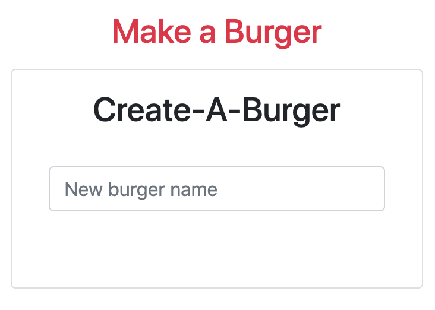

# Eat-Da-Burger

`Created by Zuoyi Phang`

## Heroku

https://eat-da-burger-unc.herokuapp.com/api/allburgers

## About

'Burger SQL' is a simple application that allows the user to create, consume, and throw away virtual burgers. This app stores all created burgers and their properties in a MySQL database.

## Screenshots

Here you can create a burger with any name and hit the "Enter" key to add the burger.

 
Here you can see the burger you have added or the remaining burgers left not eaten. There are two buttons "Eat" or "Trash". If you "Eat" the burger then the burger will move to the eaten side. If you "Trash" the burger, it will like the name states, trash the burger.
 

 
Here will display all the burgers you have eaten and you can also "Trash" the burgers if you want as well.

## Technologies Used:

- Node.JS
- Heroku
- MySQL
- Handlebars
- Express.JS
- ORM
- AJAX
